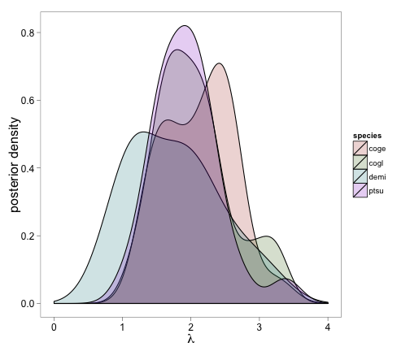

An Example of 'ggplot2'
========================================================

This is just a little example using density plots.
--------------------------------------------------------

Let's generate some data and plot the densities as if they were parameter estimates from a hierachical Bayesian model:


```r
rm(list=ls())
library(ggplot2)
```


```
## Find out what's changed in ggplot2 with
## news(Version == "0.9.0", package = "ggplot2")
```


```r
library(knitr)

dt <- rnorm(100, 2, 0.5)
sp <- c("coge", "demi", "cogl", "ptsu")
data <- data.frame(species = factor(rep(sp, each = 25)), var1=dt)

# The palette with grey:
cbPalette <- c("#999999", "#E69F00", "#56B4E9", "#009E73", "#F0E442", "#0072B2", "#D55E00", "#CC79A7")

f1 = ggplot(data, aes(x=var1, fill=species)) + geom_density(alpha=0.2) + xlab(expression(lambda)) + ylab("posterior density") +
  theme_bw() +
  scale_fill_manual(values=cbPalette) +
  scale_fill_hue(l=40) +
  scale_x_continuous(limits = c(0,4)) +
  opts(axis.title.x = theme_text(size=16),
       axis.title.y = theme_text(size=16, angle=90), 
       axis.text.x = theme_text(size=12), 
       axis.text.y = theme_text(size=12), 
       panel.grid.major = theme_blank(),
       panel.grid.minor = theme_blank(),
       legend.position = "right",
       legend.key = theme_blank()
      #legend.position = c(0.8, 3)
      )
```


This produces the plot:


```r
print(f1)
```

 


